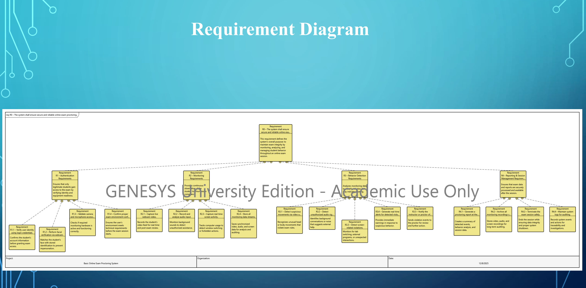
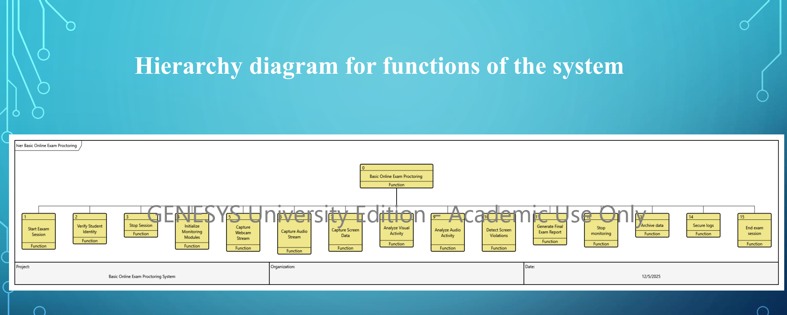

# Online Exam Proctoring System (MBSE Project)

## Overview
This project presents a system-level design of a secure online exam proctoring system using Model-Based Systems Engineering (MBSE).

The system monitors students during online exams using multiple data sources and detects suspicious activities to ensure academic integrity.

---

## Key Features
- Identity verification before exam access
- Real-time monitoring (webcam, audio, screen)
- Detection of suspicious behavior and violations
- Automated report generation
- Secure data logging and archiving

---

## System Design Approach
This system was modeled using MBSE methodologies in GENESYS.

### Diagrams used:
- EFFBD (Enhanced Functional Flow Block Diagram)
- IDEF0 (Process Modeling)
- Activity Diagram
- Sequence Diagram
- Requirement Diagram

---

## System Architecture
The system is divided into four main layers:
- Authentication
- Monitoring
- Behavior Detection
- Reporting & Data Management

---

## Purpose
This project demonstrates:
- System architecture design
- Real-time process modeling
- Data flow and behavior analysis
- Engineering-level problem solving

---

## Note
This is a system design and modeling project. Full implementation is not included.

## System Diagrams

### Activity Diagram

### Requirement Diagram

### Functional Hierarchy

### EFFBD Diagram

### IDEF0 Diagram

